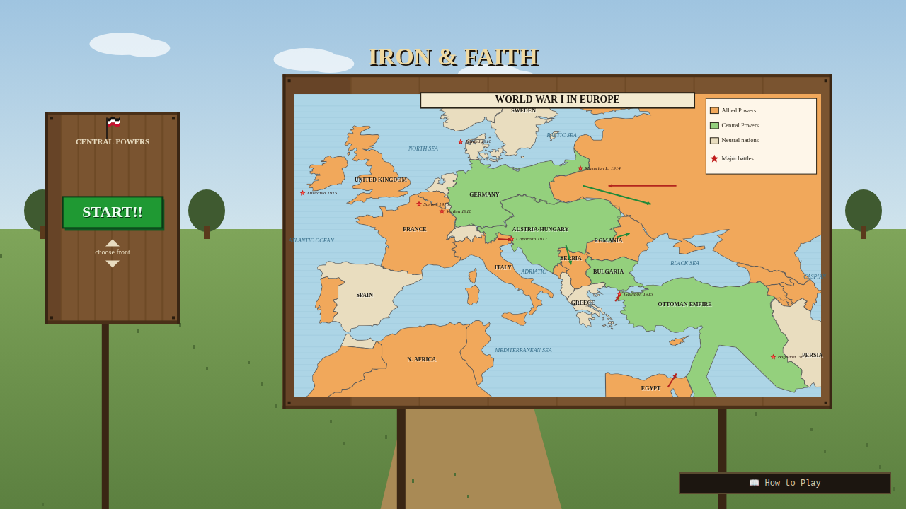
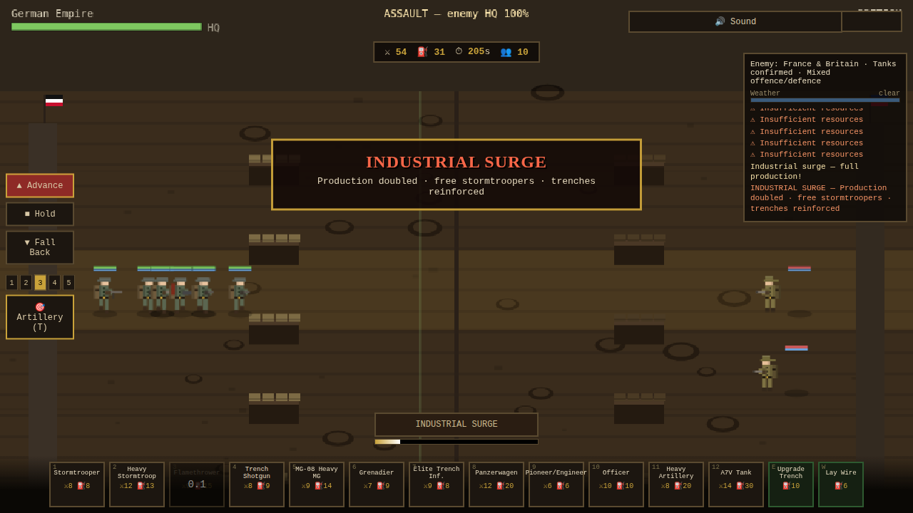
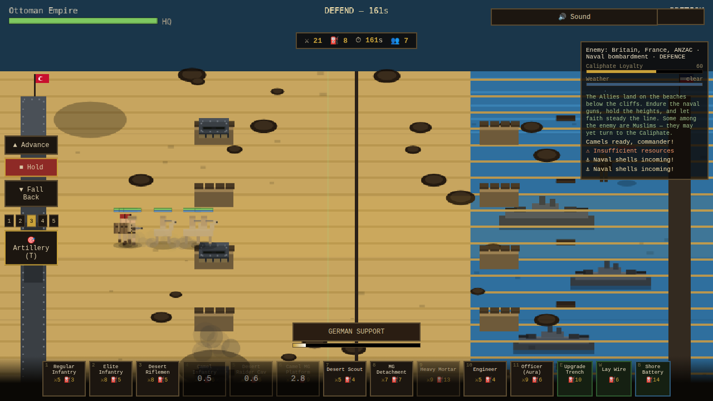
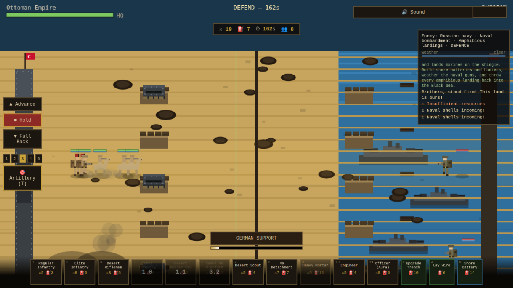
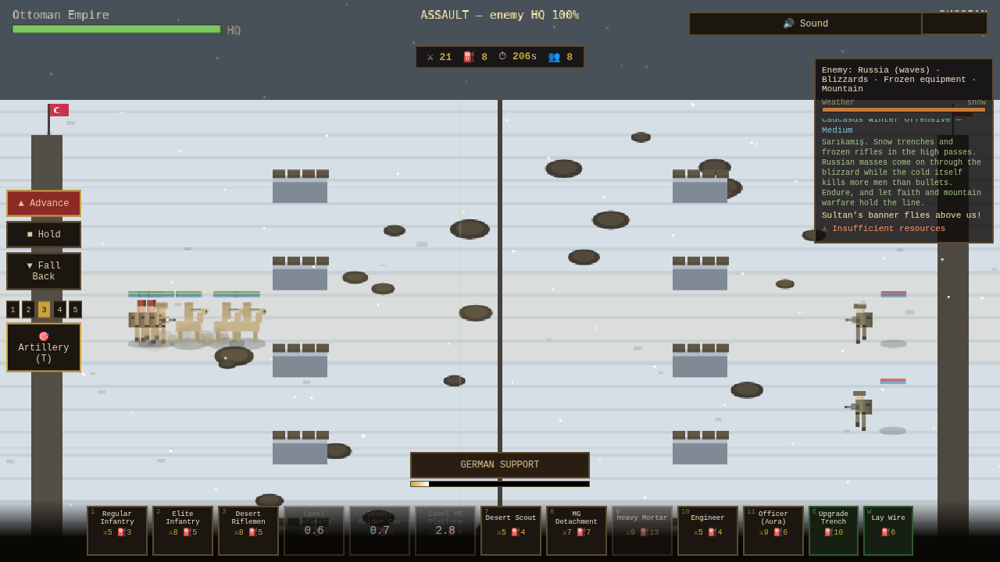
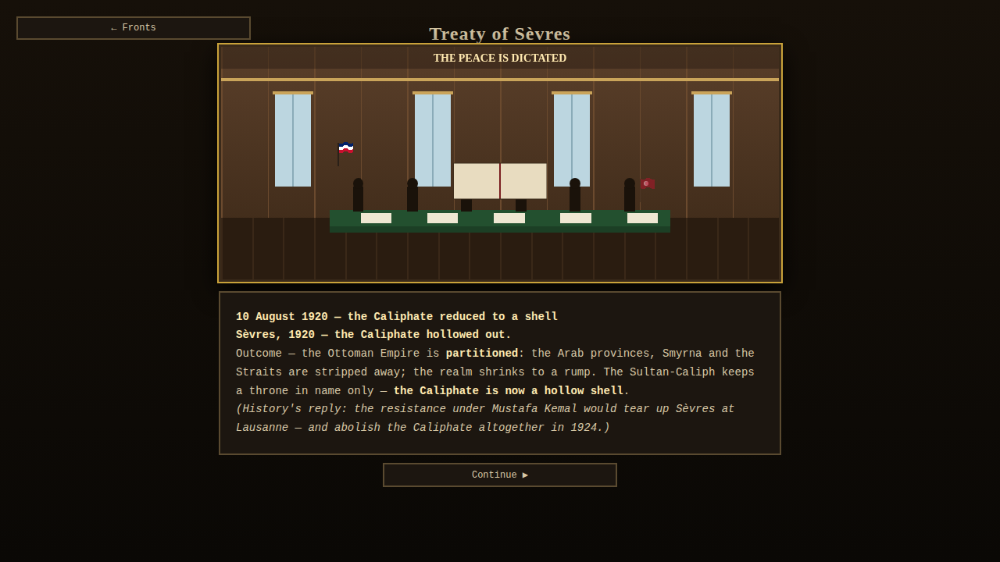
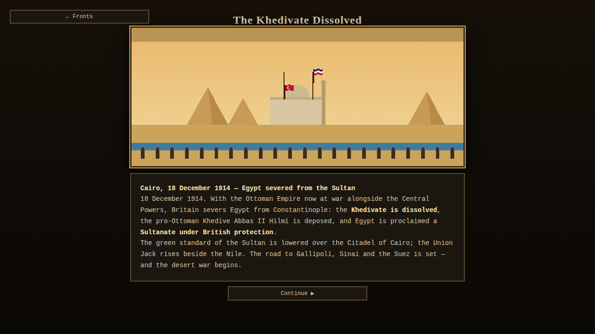

# IRON & FAITH — *Command of the Central Powers*

A WW1 **campaign-style real-time strategy game** where you are a **commander / general** of the **Central Powers** — Germany, Austria-Hungary, the Ottoman Empire, and Bulgaria. You don't play a soldier: you **spawn, position, supply and lead** whole pixel-art formations across the great fronts of the Great War.

> Pure browser game — no install, no build step. Open `index.html` and play.



## ▶ Play it now (no install)
**▶ [PLAY IN YOUR BROWSER](https://rawcdn.githack.com/shuva18325/WW1-GAME/675653c5677bd2bb699fbb05a78a044fe7a353c3/index.html)** — guaranteed-fresh snapshot of the latest build, nothing to set up.

(Always-latest branch link: <https://raw.githack.com/shuva18325/WW1-GAME/claude/ww1-central-powers-game-skaf1l/index.html>)

Or open **`index.html`** locally in any modern browser (Chrome, Firefox, Edge, Safari).
The first screen is an **opening cinematic** → **Central Powers leaders + flags** loading screen → main menu → **choose a front** → pick a difficulty → command.

## 🗺 Fronts (campaigns)
| Front | Faction | Mode | Signature |
|---|---|---|---|
| **Western Front** | Germany | Mixed | Industry, stormtroopers, **tank-fear**, 7-tier Demon ladder |
| **Gallipoli** | Ottoman | Defence | Beach landings, **naval bombardment**, colonial **defection** |
| **Palestine** | Ottoman | Mixed | Desert, camels, oases, **heat exhaustion**, German advisors |
| **Egypt / Suez** | Ottoman | Defence | Supply scarcity, religious morale, Suez events |
| **Caucasus / Eastern** | Austria-Hungary (+Ottoman) | Mixed | Snow, Russian waves, **artillery dominance**, ethnic cohesion |
| **Bulgarian Front** | Bulgaria | Defence | Mountain warfare, **ambush**, defensive multipliers |
| **Arab Revolt** | *(enemy)* Arab | Offence | **Guerrilla** raids, sabotage, hit-and-run, cut supply lines |

## ⚙ Core systems
Resource triad (Manpower / Supply / Industry) · morale, rout & **desertion** · supply lines · **engineering & trench tiers** (ditch→sandbag→reinforced→concrete) · **tanks + tank-fear** · artillery & creeping barrage · **naval bombardment** · ambush · **weather** (mud/snow/sandstorm/gas/cold) · heat & cold attrition · per-faction **special abilities** (German Support · Industrial Surge · Artillery Barrage · Mountain Hold · Desert Raid) · a full **event system** (defection, the tanks appear, gas, sabotage, blizzard, sermon…).

Every faction, unit, campaign and event is a **data-driven table** in [`js/data.js`](js/data.js) — adding a front is authoring data, not code.

## 🎮 Controls
- **1–9 / click cards** — deploy units up the active lane
- **Click battlefield / ▲▼** — pick active lane
- **A / H / F** — Advance · Hold · Fall Back
- **E / W** — upgrade trench · lay wire
- **R** — fire faction special ability (when charged)
- **Space** — pause (disabled on IMPOSSIBLE DEMON)

## 🖼 Art
Procedural **chunky pixel-art**, re-coloured & re-helmeted per nationality (Stahlhelm / fez / kabalak / Brodie / Adrian / keffiyeh), matching the reference soldier, battle scene, and tank. Gallipoli swaps the trench mud for a beach-and-sea map with landing boats.

| Western Front (trench mud) | Gallipoli (steel bunkers + fleet) |
|---|---|
|  |  |
| Black Sea Naval Clash | Caucasus Winter Offensive |
|  |  |

### v5 upgrades
**Historical 1914 borders** (from the public-domain *historical-basemaps* 1914 dataset): the theatre map now shows the **German Empire, Austro‑Hungarian Empire, Russian Empire and Ottoman Empire** as single period entities — **no independent Poland**, no modern fragmentation. · **Qing troops are now Chinese**, not Ottoman: conical rattan hats, slate‑blue/red uniforms, queues, and a proper roster — **Matchlock Musketeer, Imperial Pike, Imperial Dragoon, Palace Guard, Banner Infantry, Mandarin Officer, Imperial Cannon** (Taiping rebels fight in red). · **More detailed, more animated soldiers**: added webbing/pouches/face detail and a **reload animation** (fire → recoil → reload → aim cycle).

### v4 upgrades
**Real map, not blobs:** the signboard & intro now render the **actual country borders** of the WW1 theatre (built from public‑domain world GeoJSON, `js/europe_geo.js`) coloured by 1914 alliance — true coastlines for Britain, Iberia, Italy, Greece, Anatolia, North Africa, etc. · **Treaties & Outcomes** section with signing‑hall cutscenes and historical outcomes: **Brest‑Litovsk**, **Versailles**, **Saint‑Germain**, and **Sèvres — "the Caliphate is now a hollow shell."**

| Real-border theatre map (menu) | Treaty of Sèvres outcome |
|---|---|
|  |  |

### v3 upgrades
**Wooden signboard menu** with a **pixelated "World War I in Europe" theatre map** (green Central Powers, orange Allied, cream neutral, battle stars, movement arrows, legend) + green **START!!** button · opening cinematic shows the same map pixelated & zooming · **Air Raid system** (bombers & zeppelins, new **Fuel** resource, weather accuracy, anti-air interception, suppression & infrastructure damage — formulas in `PLANNING.md §28.2`) · **PRE-WAR campaigns**: *Taiping Rebellion* (Qing Empire), *Balkan Wars* (Ottoman), and *The Khedivate Dissolved* historical cutscene.

| Signboard menu | Pre-war: Khedivate dissolved |
|---|---|
|  |  |

### v2 upgrades
Particle FX & **screen shake** · per-weapon muzzle flashes + onomatopoeia (rifle "bang", MG "BRRRRT", arty "BAAANG!", tank "KRAA-THOOM!") · **flamethrower** with burning · animated tank treads/dust/sparks · upgraded explosions · weather animations · dynamic barrage/naval lighting · **procedural Web Audio** (weapons, ambience, rumble, march music, mute) · **deployable Officers** (morale aura, mini-barrage, reinforcements) · **manual Artillery aim mode** (trajectory + impact preview) · **naval bombardment + offshore warships + steel bunkers + shore batteries** · 4 new campaigns (Caucasus Winter, Eastern Balkans, Arabian Desert Storm, Black Sea) · 20+ new units · **opening cinematic** + animated menu · victory/defeat cutscenes + **achievement medals**.

## 📚 Design documents
- **[`PLANNING.md`](PLANNING.md)** — Section 1: the full planning section (core fantasy, visual identity, tone, campaign/difficulty/progression structure, tech trees, 28 mechanics, 26 events, 28 unit ideas, per-faction deep-dives).
- **[`GAME_DESIGN.md`](GAME_DESIGN.md)** — Section 2: the game design document (overview, every campaign, full unit system, faction buffs/debuffs, special abilities, offence/defence modes, art style, extra mechanics, file map).

## 🗂 Project layout
```
index.html          entry point (screens + canvas)
css/style.css       map-table UI theme (pixelated rendering)
js/sprites.js       procedural pixel-art sprites + per-faction palettes
js/data.js          FACTIONS · UNITS · CAMPAIGNS · EVENTS · DIFFICULTY
js/game.js          engine: loop, combat, AI, morale/supply/events, renderer
js/ui.js            screen flow + battle HUD
js/main.js          bootstrap
assets/loading.png  Central Powers leaders + flags loading screen
```

*A game of defiance under siege — making less do more, and holding the line that was not chosen.*
